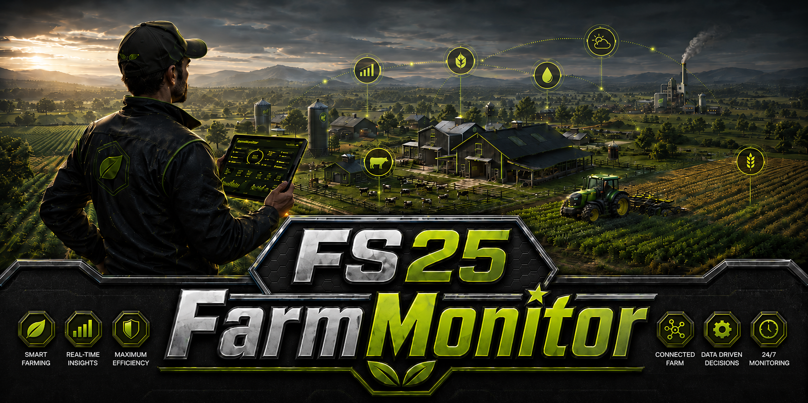
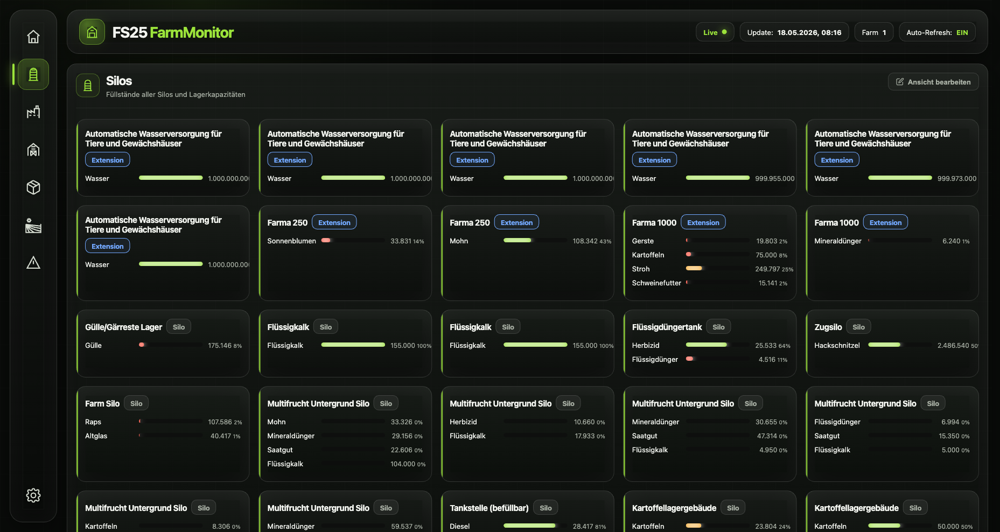
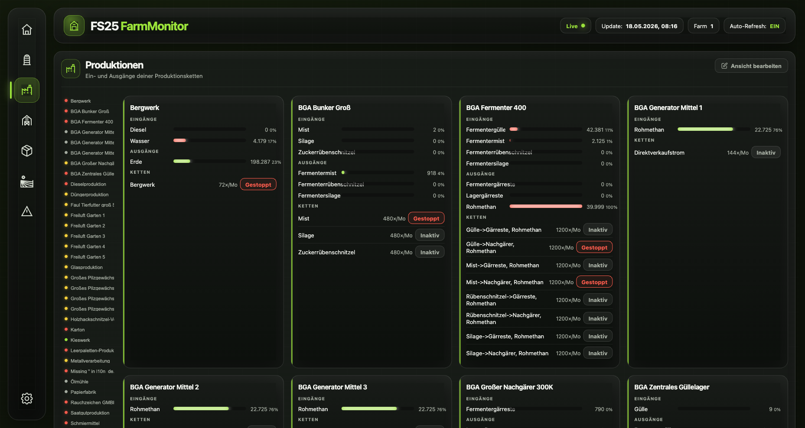
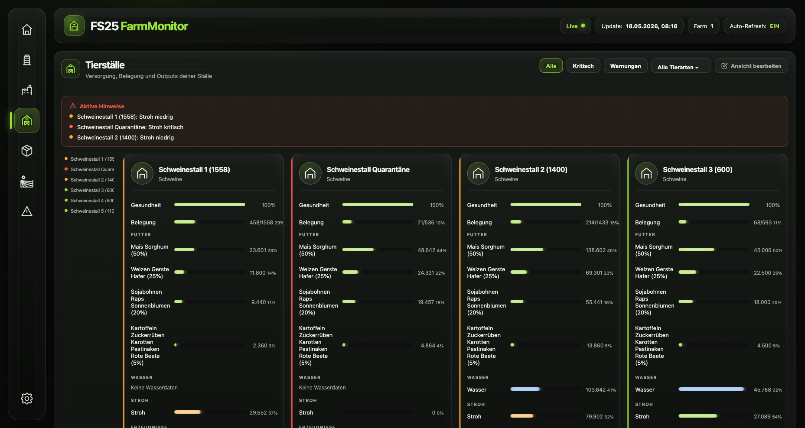
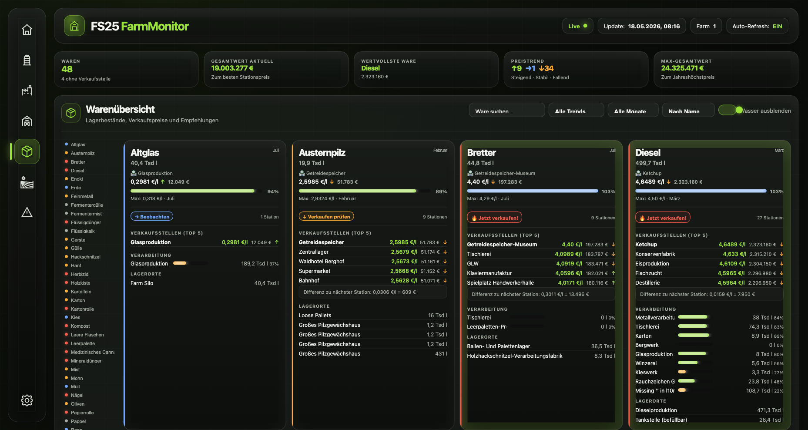
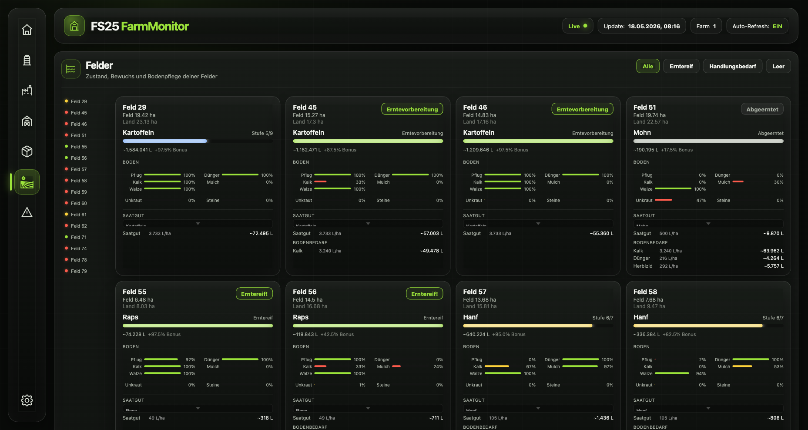

# FS25 FarmMonitor

FS25 FarmMonitor gives your Farming Simulator 25 game a second screen. A lightweight Lua mod continuously exports silo levels, production chains, animal husbandries, goods, and field states as JSON, while a small Go server picks them up and pushes live updates to a dark-themed web dashboard via Server-Sent Events — no browser refresh needed. Keep an eye on your entire farm from a second monitor, a tablet on the desk, or any device on your local network.


*Silos — Füllstände aller Silos und Lagergebäude*


*Produktionen — Ein- und Ausgänge aller Produktionsketten*


*Tierställe — Belegung, Fütterung, Gesundheit und Ausgänge pro Stall*


*Warenübersicht — Lagerbestände, Verkaufspreise und Preistrend-Indikatoren*


*Felder — Feldzustand, Bodenpflege, Bedarfsrechner und Ernteschätzung*

## Features

The dashboard updates automatically every few seconds — no refresh needed. All views are accessible via the sidebar.

### Overview
A quick summary of your entire farm at a glance: KPI tiles show how many silos are active, how many production chains are running, how many animal stalls need attention, and how many alerts are currently open. Below the tiles sits a prioritised alert list that surfaces the most urgent issues across all categories — so you always know what needs attention first without having to browse through individual views.

### Silos & Storage
Fill-level bars for every storage location on your farm — silos, silo extensions, bunker silos (with fermentation progress and compaction level), bale and pallet storage buildings, and manure heaps. Filter buttons at the top let you narrow the view to a specific storage type. Each entry shows its current fill levels by commodity so you always know what you have and how much space is left. Individual storage entries can be hidden via the Edit view button; visibility is saved per savegame so hiding a building on one map does not affect other saves.

### Productions
Input and output bars for every production chain on your farm, colour-coded by fill level so you can spot bottlenecks instantly. Each card shows whether the chain is currently running, idle or stopped, and lists all ingredients and products with their current stock and capacity. Clicking any input ingredient takes you directly to that commodity in the Goods view.

Beyond monitoring, you can control your productions directly from the dashboard: change the output mode for any product (auto-store, direct sale, or pallet output) without opening the game, and trigger the immediate ejection of a full pallet for any output — right from the browser. This works for any production building that supports pallet output, including mod productions. Individual production buildings can be hidden via the Edit view button; visibility is saved per savegame.

### Animals
Per-stall cards showing current and maximum occupancy, all food groups with fill levels (with smart weighting for parallel feeders like pigs, where not every group is equally important), water and straw levels, average animal health and all outputs like milk, manure or eggs. Alert status is colour-coded — OK, Watch, Warning or Critical — and thresholds are fully configurable per resource type in the Settings view. Individual stalls can be hidden via the Edit view button; visibility is saved per savegame.

### Goods
An aggregated overview of everything you own, sorted by commodity. Each row shows your total stock across all storage types on the farm, the current best selling price available at any station on the map, the seasonal maximum price and the best month to sell, the current trend (rising, falling or high demand), and a colour-coded rating of how the current price compares to the seasonal peak.

From the Goods view you can also act directly: for any commodity that is produced by one or more of your production buildings, you can change the output mode or trigger a pallet ejection across all relevant productions at once — without having to visit each production card individually.

### Fields
Per-field cards covering everything you need to plan your next farm run. Each card shows the current crop, growth stage with a visual progress bar, a harvest-ready badge when the time has come, and an estimated yield bonus based on your soil conditions. Seven soil condition bars — ploughing, fertilising, liming, mulching, rolling, weed coverage and stone coverage — give you a complete picture of field health at a glance.

An interactive seed calculator lets you select any crop per field and instantly shows you the required seed quantity in litres per hectare and as a total for that field. The same calculator covers lime, fertiliser and herbicide so you can plan your refill runs before you even get on the tractor. Your crop selection is saved in the browser so you don't lose it when switching views.

### Fleet
Cards for every vehicle on your farm showing current speed, fuel, AdBlue and battery levels, damage status, assigned driver and total operating hours. Clicking a card opens the detail panel with a full breakdown of all tanks, attached implements, purchase price, working width and vehicle colour. The fleet view supports filtering by shop category, free-text search by name, status filters and a "last moved" sort mode that puts recently active vehicles at the top.

**AutoDrive** status is shown directly on each fleet card — current mode, destination, remaining drive time and detailed state badges for every situation (loading, unloading, waiting for combine, driving to refuel or park, blocked, error, …). The vehicle detail panel includes a full AutoDrive control tab where you can set the operating mode, assign departure and destination markers, select the commodity to transport, and start or stop the route — all from the browser, without switching back to the game.

**Courseplay** job type, current waypoint progress and estimated remaining time are displayed on the fleet card and in the detail panel alongside AutoDrive whenever both mods are active.

### Map
An interactive map built on the farm's overview image. Field outlines are drawn as accurate polygons with field numbers placed at the centre of each field. All map hotspots — selling stations, production buildings, fuel stations, the shop, animal pastures and more — appear as colour-coded pins with tooltips. Live vehicle positions are updated every two seconds with smooth movement and direction arrows so you can follow your fleet in real time.

The map supports mouse wheel zoom, click-and-drag panning and pinch-to-zoom on touch devices. You can click any vehicle or hotspot pin to jump directly to the corresponding entry in the Fleet or Productions view.

### Alerts & Settings
The Alerts view consolidates every active warning and critical state across all categories — animals, productions, silos and fields — in one place, sorted by severity. In Settings you can adjust the warn and critical thresholds for food, water, straw, storage outputs and stall occupancy to match how you run your farm. You can also hide individual placeables from the dashboard per savegame, keeping the views clean when you have buildings you don't actively manage.

---

**Multiplayer:** every player runs the mod locally and sees their own farm's data. Singleplayer and player-hosted multiplayer are fully supported.

## How it works

FarmMonitor has two independent parts that communicate through plain JSON files on disk — no network connection between them is required.

**Inside the game (Lua mod)**
A lightweight Lua mod runs inside Farming Simulator 25 and hooks into the game's `update()` loop. Every 10 seconds it reads live data from the game's internal APIs — silo fill levels, production chains, animal stalls, vehicle states, field conditions — and writes everything out as JSON files to the FS25 modSettings directory. Some data that rarely changes (fill type definitions, fruit type growth stages, animal food recipes) is written only once when the map is loaded. Field soil conditions are sampled every 60 seconds via low-level density map queries.

The mod never reads from or writes to the internet, never opens any ports, and never modifies any game state on its own.

**Outside the game (Go server)**
A small Go binary (`farmmonitor`) watches the JSON files for changes using a file watcher. Whenever a file is updated the server parses it and immediately pushes the new data to all connected browser clients via Server-Sent Events (SSE). The dashboard HTML and all assets are embedded directly in the binary — there is no separate install step and no internet dependency. The server automatically detects the modSettings data directory — no configuration needed unless you want to override it.

**In the browser (dashboard)**
The dashboard is a single-page app that opens a persistent SSE connection to the server and re-renders any section that received new data. Because SSE is a one-way push channel, the browser never has to poll — updates appear automatically as soon as the mod writes them.

```
FS25 (game process)
  └── FarmMonitor.lua          ← reads game APIs every 10 s
        └── writes JSON files  ← modSettings folder on disk

farmmonitor (Go binary)
  └── watches JSON files       ← file watcher, no polling delay
        └── pushes SSE events  ← to all open browser tabs

Browser (dashboard)
  └── SSE connection           ← persistent, automatic updates
```

IPC commands (AutoDrive control, production output mode changes, pallet ejection, player teleport) travel the same path in reverse: the dashboard sends an HTTP request to the Go server, which writes an XML command file to the modSettings folder, and the Lua mod reads and executes it on the next update tick.

### Settings persistence

The server persists two kinds of settings as plain JSON files in the platform config directory — no database required:

| Kind | API | File location |
|---|---|---|
| Global dashboard settings | `GET/PUT /api/settings` | `<configDir>/FS25_FarmMonitor/settings.json` |
| Per-savegame placeable visibility | `GET/PUT /api/savegame/{savegameId}` | `<configDir>/FS25_FarmMonitor/savegames/<hash>.json` |

Platform config directories:
- **macOS:** `~/Library/Application Support/`
- **Windows:** `%APPDATA%\`
- **Linux:** `~/.config/`

Global settings include alert thresholds for all resource types. Placeable visibility is stored per savegame (identified by `savegameId`) so hiding a building on one map does not affect other saves.

## Exported files

All files are written to:
- **macOS:** `~/Library/Application Support/FarmingSimulator2025/modSettings/FS25_FarmMonitor/`
- **Windows:** `Documents/My Games/FarmingSimulator2025/modSettings/FS25_FarmMonitor/`

All JSON files include a `savegameId` field composed of `mapId + "_" + creationDate` (e.g. `MapUS_2026-02-15`). This uniquely identifies the active savegame and is used by the server to scope per-save settings.

### Every 2 seconds

#### `vehicles.json`

All farm vehicles: position, heading, speed, fuel/AdBlue/battery/methane levels, damage, operating hours, assigned driver, engine state, attached implements, AutoDrive status (mode, destination, remaining time, state flags), Courseplay status (job type, waypoint progress, remaining time).

```json
{
  "timestamp": "2026-05-03T22:49:23",
  "farmId": 1,
  "savegameId": "MapUS_2026-02-15",
  "vehicles": [ { "...": "see field reference below" } ],
  "players":  [ { "name": "Farmer", "x": 312.5, "z": 198.0 } ]
}
```

| Field | Type | Description |
|---|---|---|
| `id` | number | `vehicle.rootNode` handle — process-local, use for display only |
| `netId` | string | `NetworkUtil` object ID — consistent across all clients in multiplayer, used for IPC commands |
| `name` | string | Vehicle name |
| `type` | string | Detected type: `tractor`, `harvester`, `truck`, `trailer`, `implement`, `pallet`, `other` |
| `category` | string | Shop category name (e.g. `tractors`, `harvesters`) |
| `speed` | number | Current speed in km/h |
| `x` / `z` / `rot` | number | World position and Y-axis rotation in radians |
| `motorRunning` | bool | Engine is running |
| `isEntered` | bool | A player is currently driving this vehicle |
| `damage` | number | Damage level 0–1 (across vehicle and all attached implements) |
| `operatingTime` | number | Total operating hours |
| `driver` | string\|null | Username of the player currently driving, or `null` |
| `fuel` / `adblue` / `electric` / `methane` | object\|null | `{ level, capacity }` for each tank type present; `null` if not applicable |
| `implements` | array | Attached implements, each with `name`, `damage`, `type` and fill units |
| `adActive` | bool | AutoDrive is active and steering the vehicle |
| `adMode` | number\|null | AutoDrive mode (1=DriveTO, 2=PickupAndDeliver, 3=DeliverTo, 4=Load, 5=CombineUnloader) |
| `adDestination` / `adDestination2` | string\|null | AutoDrive marker names for target 1 and 2 |
| `adRemainingTime` | number\|null | Estimated remaining drive time in seconds |
| `adBlocked` / `adError` / `adOnRouteToRefuel` / `adOnRouteToPark` / `adIsLoading` / `adIsUnloading` | bool | AutoDrive state flags — only present when `true` |
| `adModeState` | string\|null | CombineUnloader sub-state: `waitToBeCalled`, `driveToCombine`, `followCombine`, `driveToUnload`, `driveToStart`, `reverseFromBadLocation` |
| `cpActive` | bool | Courseplay is active |
| `cpStatus` / `cpJobType` | string\|null | Courseplay status text and job type |
| `cpWaypointCurrent` / `cpWaypointTotal` | number\|null | Courseplay waypoint progress |
| `cpRemainingTime` | number\|null | Estimated remaining Courseplay time in seconds |

### Every 10 seconds

#### `silos.json`

Fill levels for all storage locations: silos, silo extensions, bunker silos (with fermentation progress and compaction level), bale and pallet storage buildings, manure heaps.

```json
{
  "timestamp": "2026-05-03T22:49:23",
  "farmId": 1,
  "savegame": "Mein Hof",
  "savegameId": "MapUS_2026-02-15",
  "silos": [
    {
      "uniqueId": "abc-123",
      "name": "Grosses Silo",
      "type": "silo",
      "capacity": 200000,
      "contents": [
        { "fillType": "WHEAT", "title": "Weizen", "level": 45000 }
      ]
    }
  ]
}
```

`type` is one of `silo`, `siloExtension`, `bunkerSilo`, `objectStorage`, `objectStorageMod`, `manureHeap`. Bunker silos additionally carry `fermentingPercent`, `compactedPercent` and `state` (`fill` / `closed` / `drain` / `fermented`).

#### `productions.json`

Input and output stock for every production chain: current fill levels, capacities, chain status (running / idle / stopped), cycles per month.

```json
{
  "timestamp": "2026-05-03T22:49:23",
  "farmId": 1,
  "savegame": "Mein Hof",
  "savegameId": "MapUS_2026-02-15",
  "productions": [
    {
      "uniqueId": "def-456",
      "name": "Bäckerei",
      "inputs":  [ { "fillType": "WHEAT", "title": "Weizen", "level": 1200, "capacity": 5000 } ],
      "outputs": [ { "fillType": "BREAD", "title": "Brot",   "level":  300, "capacity": 1000 } ],
      "productions": [
        { "id": "bread", "name": "Brot backen", "status": "running", "cyclesPerMonth": 12 }
      ]
    }
  ]
}
```

`status` is one of `running`, `inactive`, `stopped`. `outputs` also carry `outputMode` (`auto` / `sell` / `pallet`) and `palletFillType` when pallet output is active.

#### `husbandries.json`

Per-stall animal count and capacity, all food groups with fill levels and weights, water and straw levels, average animal health, all output fill levels.

```json
{
  "timestamp": "2026-05-03T22:49:23",
  "farmId": 1,
  "savegame": "Mein Hof",
  "savegameId": "MapUS_2026-02-15",
  "husbandries": [
    {
      "uniqueId": "ghi-789",
      "name": "Kuhstall",
      "animalType": "COW",
      "numAnimals": 24,
      "maxAnimals": 30,
      "food":      [ { "title": "Mischration", "value": 800, "capacity": 1000 } ],
      "foodTotal": { "value": 800, "capacity": 1000, "ratio": 0.8 },
      "water":     { "value": 600, "capacity": 1000 },
      "straw":     { "value": 400, "capacity": 1000 },
      "health":    92,
      "outputs": [
        { "fillType": "MILK",   "title": "Milch", "level": 4200, "capacity": 10000 },
        { "fillType": "MANURE", "title": "Mist",  "level":  800, "capacity":  5000 }
      ]
    }
  ]
}
```

| Field | Type | Description |
|---|---|---|
| `uniqueId` | string | Persistent placeable ID from the savegame |
| `animalType` | string | Animal type identifier (e.g. `COW`, `PIG`) or `"unknown"` |
| `numAnimals` / `maxAnimals` | number | Current count and maximum capacity |
| `food` | array | Food trough entries with `title`, `value` and `capacity` per group |
| `foodTotal` | object\|null | Combined food level `{ value, capacity, ratio }` — `null` if no food trough |
| `water` | object\|null | Water level `{ value, capacity }` — `null` if no water trough |
| `straw` | object\|null | Straw bedding level `{ value, capacity }` — `null` if no straw trough |
| `health` | number\|null | Average animal health 0–100 — `null` if no animals present |
| `outputs` | array | Output storage entries with `fillType`, `title`, `level` and `capacity` |

#### `goods.json`

Aggregated stock per commodity across all storage types, current best selling price per station, seasonal maximum price and best selling month, price trend (rising / falling / high demand).

```json
{
  "timestamp": "2026-05-03T22:49:23",
  "farmId": 1,
  "savegame": "Mein Hof",
  "savegameId": "MapUS_2026-02-15",
  "goods": [
    {
      "fillType": "WHEAT",
      "title": "Weizen",
      "totalLevel": 45000,
      "bestPrice": 1.42,
      "bestStation": "Getreidemühle",
      "maxPrice": 1.89,
      "bestMonth": 3,
      "trend": "CLIMBING",
      "greatDemand": false,
      "stations": [
        { "name": "Getreidemühle", "price": 1.42, "trend": "CLIMBING", "greatDemand": false },
        { "name": "Hafen",        "price": 1.18, "trend": "FALLING",  "greatDemand": false }
      ]
    }
  ]
}
```

`trend` is one of `CLIMBING`, `FALLING`, `GREAT_DEMAND` or `null`. `bestMonth` is a season period index (1–12). `totalLevel` is the sum across all storage types on the farm (silos, bales, pallets, husbandry outputs, production outputs).

#### `vehicleMeta.json`

Static vehicle metadata that rarely changes: brand, shop category, purchase price, ownership type (owned / leased), age, engine power (kW), working width, vehicle colours (hex).

### Every 30 seconds

#### `weather.json`

Current weather (type, temperature, wind speed and direction, rain intensity, ground wetness), 6-hour hourly forecast and 7-day daily forecast, in-game time and season period.

```json
{
  "timestamp": "2026-05-03T22:49:23",
  "current": {
    "type": "RAIN",
    "temperature": 14,
    "windSpeed": 22,
    "windDir": 270,
    "windCardinal": "W",
    "isRaining": true,
    "rainScale": 65,
    "groundWet": 80
  },
  "hourly": [
    { "type": "RAIN",  "temperature": 14, "windSpeed": 22, "windDir": 270, "time": "14:00" },
    { "type": "CLOUDY","temperature": 13, "windSpeed": 18, "windDir": 265, "time": "15:00" }
  ],
  "daily": [
    { "type": "CLOUDY", "high": 16, "low": 9, "windSpeed": 20, "windDir": 260, "day": 4, "dayInPeriod": 1, "period": 3, "label": "Montag, Früh-Sommer" }
  ],
  "gameTime": { "hour": 14, "minute": 23, "isDay": true, "period": 3, "dayInPeriod": 1 }
}
```

`type` is one of `SUN`, `PARTIALLY_CLOUDY`, `CLOUDY`, `RAIN`, `THUNDER`, `SNOW`, `HAIL`, `TWISTER`. `rainScale` and `groundWet` are 0–100. `hourly` covers the next 6 hours, `daily` the next 7 in-game days.

### Every 60 seconds

#### `fields.json`

Per-field crop type, growth stage, harvest readiness, projected yield bonus, seven soil condition values (ploughing, fertilising, liming, mulching, rolling, weed coverage, stone coverage), seed and material need estimates.

```json
{
  "timestamp": "2026-05-03T22:49:23",
  "farmId": 1,
  "savegameId": "MapUS_2026-02-15",
  "fields": [ { "...": "see field reference below" } ]
}
```

| Field | Type | Description |
|---|---|---|
| `id` | string | Field number (from farmland name) |
| `farmlandId` | number | Farmland ID |
| `owned` | bool | Belongs to the player's farm |
| `cx` / `cz` | number | Field centre in world coordinates |
| `polygon` | object | `{ x: [...], z: [...] }` — field outline in world coordinates |
| `area` | number | Total farmland area in ha (including road edges) |
| `fieldArea` | number | Cultivable field area in ha (owned fields only) |
| `fruitType` | string | Internal crop identifier (e.g. `WHEAT`) |
| `fruitTitle` | string | Localised crop name (e.g. `Weizen`) |
| `growthStage` | number | Current growth stage index |
| `harvestReady` | bool | Crop is ready to harvest |
| `needsPreparation` | bool | Crop requires a preparation step before harvest (e.g. rolling oilseed rape) |
| `withered` | bool | Crop has withered |
| `cut` | bool | Field has been harvested or mown |
| `yieldBonusPct` | number\|null | Projected yield bonus in % based on current soil conditions |
| `mulchPct` / `plowPct` / `needsRollingPct` / `fertPct` / `limePct` / `weedPct` / `stonePct` | number | Soil condition values 0–100 |
| `seedLph` / `seedTotal` | number\|null | Seed requirement in l/ha and total litres |
| `matLimeLph` / `matLimeTotal` | number\|null | Lime requirement in l/ha and total litres |
| `matFertLph` / `matFertTotal` | number\|null | Fertiliser requirement in l/ha and total litres |
| `matHerbLph` / `matHerbTotal` | number\|null | Herbicide requirement in l/ha and total litres |

Unowned fields only carry `id`, `farmlandId`, `owned: false`, `cx`, `cz`, `polygon` and `area`.

#### `autoDriveMarkers.json`

All AutoDrive markers with name, group and marker index. Only present when AutoDrive is installed. Updated incrementally — only re-exported when new markers are detected.

```json
{
  "savegameId": "MapUS_2026-02-15",
  "markers": [
    { "id": 22, "name": "Wald 107", "group": "Wälder" },
    { "id":  1, "name": "Haupthof", "group": "Höfe" }
  ],
  "groups": ["Alle", "Höfe", "Wälder"]
}
```

`id` is the `markerIndex` that AutoDrive's `setFirstMarker()` accepts.

### Continuously (incremental, a few rows per frame)

#### `layer_*.json`

Full-map soil density grids (one file per layer: `weed`, `stone`, `plow`, `spray`, `lime`, `mulch`, `roller`) used for the soil overlay in the Map view. Written incrementally to avoid frame spikes.

### Once on map load

#### `fillTypes.json`

All fill type names, display titles and HUD icon paths.

```json
{
  "savegameId": "MapUS_2026-02-15",
  "fillTypes": [
    {
      "name": "WHEAT",
      "title": "Weizen",
      "hudOverlayFilename": "dataS/menu/hud/fillTypes/hud_fill_wheat.png"
    }
  ]
}
```

Icon paths use two formats: base-game icons are relative to the FS25 installation directory (`dataS/…`); mod icons are absolute paths to the mod folder.

#### `animalFood.json`

Food group recipes per animal type: consumption type (serial / parallel), fill types accepted per group, production weight and eat weight.

```json
{
  "savegameId": "MapUS_2026-02-15",
  "animalFood": {
    "PIG": {
      "consumptionType": "PARALLEL",
      "groups": [
        { "title": "Mais Sorghum",                 "productionWeight": 0.5,  "eatWeight": 0.5,  "fillTypes": ["CORN", "SORGHUM"] },
        { "title": "Weizen Gerste Hafer",          "productionWeight": 0.25, "eatWeight": 0.25, "fillTypes": ["WHEAT", "BARLEY", "OAT"] },
        { "title": "Sojabohnen Raps Sonnenblumen", "productionWeight": 0.2,  "eatWeight": 0.2,  "fillTypes": ["SOYBEAN", "CANOLA", "SUNFLOWER"] },
        { "title": "Kartoffeln Zuckerrüben …",     "productionWeight": 0.05, "eatWeight": 0.05, "fillTypes": ["POTATO", "SUGARBEET"] }
      ]
    },
    "COW": {
      "consumptionType": "SERIAL",
      "groups": [
        { "title": "TMR",  "productionWeight": 1.0, "eatWeight": 1.0, "fillTypes": ["FORAGE_MIXING"] },
        { "title": "Heu",  "productionWeight": 0.8, "eatWeight": 1.0, "fillTypes": ["DRYGRASS_WINDROW"] },
        { "title": "Gras", "productionWeight": 0.4, "eatWeight": 1.0, "fillTypes": ["GRASS_WINDROW"] }
      ]
    }
  }
}
```

| Field | Description |
|---|---|
| `consumptionType` | `PARALLEL` — all groups consumed simultaneously (e.g. pigs); `SERIAL` — groups are alternatives, best available is used (e.g. cows) |
| `productionWeight` | Productivity factor this group provides (0–1). For `PARALLEL` types: also the share of total consumption |
| `eatWeight` | Consumption share for `PARALLEL` animals (0–1, all groups sum to 1). Used to scale alert thresholds so minor components don't trigger false alarms |
| `fillTypes` | Fill type identifiers accepted by this group |

#### Static metadata

| File | Content |
|---|---|
| `mapMeta.json` | Map name, terrain size in metres, path to the overview DDS image and savegame directory — used by the server to locate and decode the map background |
| `fieldMeta.json` | Maximum density map values for all soil layers (`sprayLevelMax`, `limeLevelMax`, `plowLevelMax`, …) — used to normalise soil readings in the Map view |
| `hotspots.json` | All map hotspots with name, type (selling station, production, fuel, shop, beehive, animal husbandry, …) and world coordinates |
| `fruitTypes.json` | All fruit types with growth stage definitions, harvest stages, forage stages, yield per m² and seed usage per m² |
| `vehicleCategories.json` | All shop vehicle categories with display name and sort order — used to populate the category filter in the Fleet view |
| `modInfo.json` | FarmMonitor version and savegame ID — used by the server to detect version mismatches |

## Installation

1. Copy the `FS25_FarmMonitor` folder into your FS25 mods directory:
   - **macOS:** `~/Library/Application Support/FarmingSimulator2025/mods/`
   - **Windows:** `Documents/My Games/FarmingSimulator2025/mods/`
2. Enable the mod in the in-game mod manager.
3. Load a savegame — the JSON files appear in the modSettings folder within the first few seconds.
4. Download and start the dashboard server (see below).

## Dashboard

### Download

Download the latest binary for your OS from the [Releases page](https://github.com/Cypris2010/FS25_FarmMonitor/releases):

| OS | File |
|---|---|
| macOS (Apple Silicon) | `farmmonitor-macos-apple` |
| macOS (Intel) | `farmmonitor-macos-intel` |
| Windows | `farmmonitor-windows.exe` |

### Run on macOS

Make the file executable, then start it:

```bash
chmod +x farmmonitor-macos-apple
./farmmonitor-macos-apple
```

> **macOS security warning:** Because the binary is not signed with an Apple developer certificate, macOS will block it on first launch with a message like *"farmmonitor-macos-apple cannot be opened because it is from an unidentified developer."*
>
> To allow it, open **System Settings → Privacy & Security**, scroll down to the blocked app and click **Allow Anyway**. Alternatively, remove the quarantine flag from the terminal:
> ```bash
> xattr -d com.apple.quarantine farmmonitor-macos-apple
> ```

### Run on Windows

Double-click `farmmonitor-windows.exe` or run it from a terminal.

> **Windows security warning:** Windows SmartScreen may block the binary on first launch with a message like *"Windows protected your PC."* Click **More info** and then **Run anyway** to proceed.

### Options

| Flag | Default | Description |
|---|---|---|
| `-port` | `8080` | HTTP listen port |
| `-host` | `127.0.0.1` | Listen address — use `0.0.0.0` for LAN / tablet access |
| `-data` | auto-detected | Path to the directory containing the JSON data files |

```bash
./farmmonitor -host 0.0.0.0 -port 9000
./farmmonitor -data /custom/path/to/json/files
```

Open **http://localhost:8080** in a browser.

### Build from source (optional)

If you prefer to compile the binary yourself, you need [Go 1.22+](https://go.dev/dl/) installed.

```bash
cd path/to/FS25_FarmMonitor/Server
go build -o farmmonitor      # macOS / Linux
go build -o farmmonitor.exe  # Windows
./farmmonitor
```

## Credits

The following mods were used as references for FS25 Lua API patterns during development. No code was copied directly — they served as documentation where no official API reference exists.

| Mod | Author | Used for |
|---|---|---|
| [FS25_RealisticLivestockRM](https://github.com/rittermod/FS25_RealisticLivestockRM) | Ritter | `AnimalFoodSystem` API, food group patterns (`eatWeight`, `consumptionType`, `SERIAL`/`PARALLEL`), husbandry food level methods |
| [FS25_TSStockCheck](https://github.com/twproductions/FS25_TSStockCheck) | twproductions | Silo, silo-extension, husbandry storage and production storage access patterns |
| [FS25_additionalFieldInfo](https://github.com/yumi-modding/FS25_additionalFieldInfo) | yumi-modding | Field state iteration via `g_farmlandManager.farmlands` |
| [FS25_BetterContracts](https://github.com/Mmtrx/FS25_BetterContracts) | Mmtrx | Practical usage of field state APIs |
| [FS25_FarmlandOverview](https://www.farming-simulator.com/mod.php?mod_id=313618) | Fetty42 | `DensityMapModifier` approach for soil state sampling (mulch, plow, roll, fert, lime, weeds, stones) and `getHarvestScaleMultiplier` yield bonus |
| [FS25_fieldCalculator](https://www.farming-simulator.com/mod.php?mod_id=323639) | [Weekend Farmers] T4xs | Inspiration for the field need calculator (seed usage via `ft.seedUsagePerSqm`, spray type application rates via `g_sprayTypeManager`) |
| [FS25_LiveMap_Companion v2](https://www.farming-simulator.com/mod.php?mod_id=340236) | Achimobil | Confirmed the `overview.dds` 50%-centre convention (`imgW * 0.50`) used for map coordinate conversion; vehicle export patterns |
| [FS25_VG_Livemap](https://www.modhub.us/farming-simulator-2025-mods/fs25-vg-livemap/) | VG-Modding | Hotspot export structure and general map-view architecture reference |
| [FS25_AutoDrive](https://github.com/Stephan-S/FS25_AutoDrive) | Stephan Schlosser | AutoDrive integration — see note below |

### AutoDrive integration

FarmMonitor integrates with [FS25_AutoDrive](https://github.com/Stephan-S/FS25_AutoDrive) by Stephan Schlosser (MIT License) to display AutoDrive status information and allow basic control from the dashboard.

**FarmMonitor does not bundle or distribute any AutoDrive files.**

If AutoDrive is installed, the FarmMonitor server reads `FS25_AutoDrive.zip` directly from the user's own FS25 mods folder at startup. Icons are extracted from that ZIP, recoloured in memory to match the dashboard's colour scheme, and cached for the current session only. Nothing is written to disk and nothing is redistributed. If AutoDrive is not installed, the integration is silently skipped.

The Lua side interacts with AutoDrive through two mechanisms:

- **`vehicle.ad` StateModule API** — reading vehicle state (`stateModule:isActive()`, `stateModule:getMode()`, marker names, remaining time, etc.) and sending control commands (`sm:setMode()`, `sm:setFirstMarker()`, `currentMode:start()`, `vehicle:stopAutoDrive()`, …). These are the methods documented in AutoDrive's `scripts/ExternalInterface.lua` and `scripts/Specialization.lua`.
- **`AutoDriveUpdateSettingsEvent`** — changing AutoDrive settings (pipe offset, follow distance, corner speed, restrict-to-field, etc.) by firing the same internal network event that AutoDrive's own in-game UI uses. This is the only correct way to change settings and have them synced to all clients; direct field writes alone are not sufficient in multiplayer. `vehicle.ad.settings[name]` is also read directly to query the current value.

The full technical breakdown of both command paths (singleplayer, listen-server, dedicated server) is documented in [`ai/api_autodrive_commands.md`](ai/api_autodrive_commands.md).

## Third-party libraries

| Library | License | Used for |
|---|---|---|
| [Tabler Icons](https://tabler.io/icons) | [MIT](https://github.com/tabler/tabler-icons/blob/main/LICENSE) © 2020-2026 Paweł Kuna | Icons in the dashboard UI |
| [game-icons.net](https://game-icons.net) — "Thrust Bend" by [Delapouite](https://delapouite.com) | [CC BY 3.0](https://creativecommons.org/licenses/by/3.0/) | Vehicle type icon |
| [game-icons.net](https://game-icons.net) — "Gas Pump" by [Delapouite](https://delapouite.com) | [CC BY 3.0](https://creativecommons.org/licenses/by/3.0/) | Fuel icon |
| [game-icons.net](https://game-icons.net) — "Auto Repair" by [Lorc](https://lorcblog.blogspot.com) | [CC BY 3.0](https://creativecommons.org/licenses/by/3.0/) | Vehicle repair icon |
| [game-icons.net](https://game-icons.net) — "Cow", "Sheep", "Chicken", "Horse Head", "Goose", "Rabbit" by [Delapouite](https://delapouite.com) | [CC BY 3.0](https://creativecommons.org/licenses/by/3.0/) | Animal icons in husbandry view and map hotspot pins |
| [game-icons.net](https://game-icons.net) — "Pig" by [Skoll](https://game-icons.net/about.html#authors) | [CC BY 3.0](https://creativecommons.org/licenses/by/3.0/) | Pig icon in husbandry view and map hotspot pins |
| [game-icons.net](https://game-icons.net) — "Sell Card" by [Delapouite](https://delapouite.com) | [CC BY 3.0](https://creativecommons.org/licenses/by/3.0/) | Selling station icon on map |
| [polylabel](https://github.com/mapbox/polylabel) by Mapbox | [ISC](https://github.com/mapbox/polylabel/blob/master/LICENSE) © 2016 Mapbox | Pole of inaccessibility for field number placement on map |

Full license texts are listed in [`THIRD_PARTY_NOTICES`](THIRD_PARTY_NOTICES).
