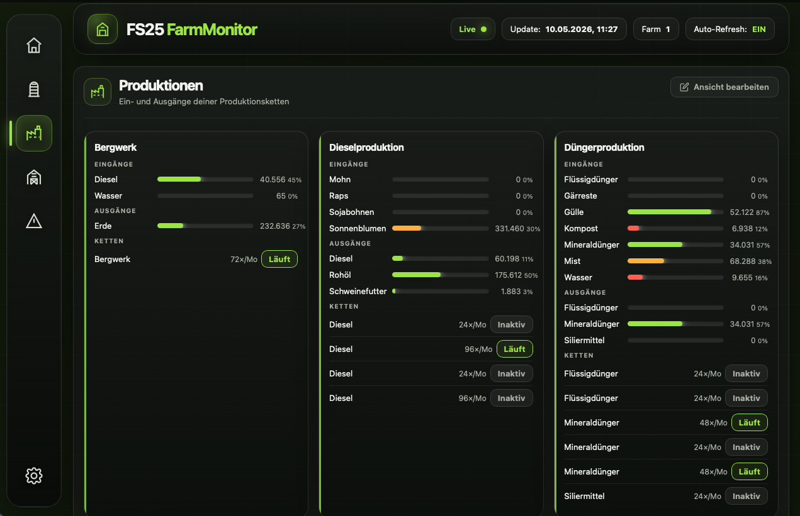

# FS25 FarmMonitor

FS25 FarmMonitor gives your Farming Simulator 25 game a second screen. A lightweight Lua mod continuously exports silo levels, production chains, animal husbandries and fill types as JSON, while a small Go server picks them up and pushes live updates to a dark-themed web dashboard via Server-Sent Events — no browser refresh needed. Keep an eye on your entire farm from a second monitor, a tablet on the desk, or any device on your local network.


*Productions view — inputs, outputs and chain status per production point*

## Features

- **Live JSON export** — silos, productions, animal husbandries, fill types and animal food recipes written to the modSettings folder
- **Unique placeable IDs** — every silo, production point and husbandry carries a persistent `uniqueId` (from the savegame) and a `savegameId` (`mapId + creationDate`) for reliable cross-session identification
- **Web dashboard** — dark FS25-themed SPA with sidebar navigation, auto-refresh via Server-Sent Events and responsive layout
- **Views:** Overview (KPI tiles + active alerts), Silos, Productions, Animal Husbandries, Alerts, Settings
- **Tierställe detail page** — per-stall cards with occupancy, food, water and output progress bars, computed status (OK / Watch / Warning / Critical) and a warning band for urgent issues
- **Smart husbandry alerts** — food group alerts are weighted by consumption share (`eatWeight`): a pig's minor food component (e.g. root vegetables at 5%) only triggers a warning when nearly empty, avoiding false alarms
- **Configurable alert thresholds** — warn and critical levels for inputs (food/water/straw), outputs and occupancy are adjustable in the Settings view and stored globally
- **Per-savegame visibility settings** — hide individual placeables from the dashboard via the edit mode button; settings are persisted per savegame on the server

## What it exports

| File | Content | Updated |
|---|---|---|
| `silos.json` | All silo and silo extension fill levels | every 10 s |
| `productions.json` | Production point inputs, outputs and chain status | every 10 s |
| `husbandries.json` | Animal counts, food/water/straw levels, health and outputs (milk, manure, …) | every 10 s |
| `fillTypes.json` | All fill type names, titles and HUD icon paths | once on map load |
| `animalFood.json` | Food group recipes per animal type (consumption type, fill types, production and eat weights) | once on map load |

All files are written to the modSettings directory:
- **macOS:** `~/Library/Application Support/FarmingSimulator2025/modSettings/FS25_FarmMonitor/`
- **Windows:** `Documents/My Games/FarmingSimulator2025/modSettings/FS25_FarmMonitor/`

## Dashboard

The dashboard is a single-page app served by a small Go binary (`farmmonitor`). It connects to the server via Server-Sent Events and re-renders automatically whenever the mod writes new data (~every 10 s).

The server automatically detects the JSON data directory from the FS25 modSettings folder — no need to run it from a specific location.

### Start — Download (empfohlen)

Download the latest binary for your OS from the [Releases page](https://github.com/Cypris2010/FS25_FarmMonitor/releases):

| OS | File |
|---|---|
| macOS (Apple Silicon) | `farmmonitor-macos-apple` |
| macOS (Intel) | `farmmonitor-macos-intel` |
| Windows | `farmmonitor-windows.exe` |

**macOS:** Make the file executable before running:
```bash
chmod +x farmmonitor-macos-apple
./farmmonitor-macos-apple
```

> **Note:** macOS may block the binary on first launch. Go to **System Settings → Privacy & Security** and click **Allow Anyway**, or run:
> ```bash
> xattr -d com.apple.quarantine farmmonitor-macos-apple
> ```

**Windows:** Double-click `farmmonitor-windows.exe` or run it from the terminal.

### Start — Build from source (optional)

Requires [Go 1.22+](https://go.dev/dl/) to be installed.

```bash
cd path/to/FS25_FarmMonitor/Server
go build -o farmmonitor      # macOS / Linux
go build -o farmmonitor.exe  # Windows
./farmmonitor
```

Open **http://localhost:8080** in a browser.

### Options

| Flag | Default | Description |
|---|---|---|
| `-port` | `8080` | HTTP listen port |
| `-host` | `127.0.0.1` | Listen address — use `0.0.0.0` for LAN / tablet access |
| `-data` | auto-detected | Path to the directory containing the JSON data files |

```bash
./farmmonitor -host 0.0.0.0 -port 9000
./farmmonitor -data /custom/path/to/json/files
```

### Navigation

| View | Description |
|---|---|
| Overview | KPI tiles (silo count, productions, stalls, open alerts) and a prioritised alert list |
| Silos | Fill-level bars for every silo and silo extension |
| Productions | Input/output bars and chain status (running / inactive / stopped) per production point |
| Tierställe | Per-stall cards with occupancy, food, water, outputs and computed status |
| Alerts | Consolidated list of all active warnings across all categories |
| Settings | Toggle visibility of individual placeables per savegame; configure alert thresholds for inputs, outputs and occupancy |

### Editing the dashboard view

Each section (Silos, Productions, Tierställe) has an **„Ansicht bearbeiten"** button in the top-right corner of the section header.

- **Normal mode** — hidden placeables are not shown
- **Edit mode** — all placeables are shown; a green eye means visible, a grey crossed-out eye means hidden; hidden cards are dimmed
- Clicking the eye icon on any card toggles its visibility immediately and saves the setting to the server

Settings are stored per savegame (identified by `savegameId`) so hiding a silo on one map does not affect other savegames.

## Server settings storage

The server persists two kinds of settings using the platform config directory:

| Kind | API | File location |
|---|---|---|
| Global dashboard settings | `GET/PUT /api/settings` | `<configDir>/FS25_FarmMonitor/settings.json` |
| Per-savegame placeable visibility | `GET/PUT /api/savegame/{savegameId}` | `<configDir>/FS25_FarmMonitor/savegames/<hash>.json` |

Platform config directories:
- **macOS:** `~/Library/Application Support/`
- **Windows:** `%APPDATA%\`
- **Linux:** `~/.config/`

## Installation

1. Copy the `FS25_FarmMonitor` folder into your FS25 mods directory:
   - **macOS:** `~/Library/Application Support/FarmingSimulator2025/mods/`
   - **Windows:** `Documents/My Games/FarmingSimulator2025/mods/`
2. Enable the mod in the in-game mod manager.
3. Load a savegame — the JSON files appear in the modSettings folder within the first few seconds.
4. Build and start the dashboard server from the `Server` folder (see above).

## JSON structure

### silos.json
```json
{
  "timestamp": "2026-05-03T22:49:23",
  "farmId": 1,
  "savegame": "Mein Hof",
  "savegameId": "MapUS_2026-02-15",
  "silos": [
    {
      "uniqueId": "abc-123",
      "name": "Grosses Silo",
      "type": "silo",
      "capacity": 200000,
      "contents": [
        { "fillType": "WHEAT", "title": "Weizen", "level": 45000 }
      ]
    }
  ]
}
```

### productions.json
```json
{
  "timestamp": "2026-05-03T22:49:23",
  "farmId": 1,
  "savegame": "Mein Hof",
  "savegameId": "MapUS_2026-02-15",
  "productions": [
    {
      "uniqueId": "def-456",
      "name": "Bäckerei",
      "inputs":  [ { "fillType": "WHEAT", "title": "Weizen", "level": 1200, "capacity": 5000 } ],
      "outputs": [ { "fillType": "BREAD", "title": "Brot",   "level":  300, "capacity": 1000 } ],
      "productions": [
        { "id": "bread", "name": "Brot backen", "status": "running", "cyclesPerMonth": 12 }
      ]
    }
  ]
}
```

### husbandries.json
```json
{
  "timestamp": "2026-05-03T22:49:23",
  "farmId": 1,
  "savegame": "Mein Hof",
  "savegameId": "MapUS_2026-02-15",
  "husbandries": [
    {
      "uniqueId": "ghi-789",
      "name": "Kuhstall",
      "animalType": "COW",
      "numAnimals": 24,
      "maxAnimals": 30,
      "food":      [ { "title": "Mischration", "value": 800, "capacity": 1000 } ],
      "foodTotal": { "value": 800, "capacity": 1000, "ratio": 0.8 },
      "water":     { "value": 600, "capacity": 1000 },
      "straw":     { "value": 400, "capacity": 1000 },
      "health":    92,
      "outputs": [
        { "fillType": "MILK",   "title": "Milch", "level": 4200, "capacity": 10000 },
        { "fillType": "MANURE", "title": "Mist",  "level":  800, "capacity":  5000 }
      ]
    }
  ]
}
```

Field reference:

| Field | Type | Description |
|---|---|---|
| `uniqueId` | string | Persistent placeable ID from the savegame |
| `name` | string | Placeable name set by the player |
| `animalType` | string | Animal type identifier (e.g. `COW`, `PIG`) or `"unknown"` |
| `numAnimals` | number | Current animal count |
| `maxAnimals` | number | Maximum capacity |
| `food` | array | Food trough entries with `title`, `value` and `capacity` per group |
| `foodTotal` | object\|null | Combined food level `{ value, capacity, ratio }` — `null` if stall has no food trough |
| `water` | object\|null | Water level `{ value, capacity }` — `null` if stall has no water trough |
| `straw` | object\|null | Straw bedding level `{ value, capacity }` — `null` if stall uses no straw |
| `health` | number\|null | Average animal health 0–100 — `null` if no animals are present |
| `outputs` | array | Output storage entries with `fillType`, `title`, `level` and `capacity` |

### fillTypes.json
```json
{
  "savegameId": "MapUS_2026-02-15",
  "fillTypes": [
    {
      "name": "WHEAT",
      "title": "Weizen",
      "hudOverlayFilename": "dataS/menu/hud/fillTypes/hud_fill_wheat.png"
    }
  ]
}
```

Icon paths use two formats depending on their origin:
- **Base game:** `dataS/menu/hud/fillTypes/...` — relative to the FS25 installation directory
- **Mods:** absolute path to the mod folder

### animalFood.json
```json
{
  "savegameId": "MapUS_2026-02-15",
  "animalFood": {
    "PIG": {
      "consumptionType": "PARALLEL",
      "groups": [
        { "title": "Mais Sorghum",                 "productionWeight": 0.5,  "eatWeight": 0.5,  "fillTypes": ["CORN", "SORGHUM"] },
        { "title": "Weizen Gerste Hafer",          "productionWeight": 0.25, "eatWeight": 0.25, "fillTypes": ["WHEAT", "BARLEY", "OAT"] },
        { "title": "Sojabohnen Raps Sonnenblumen", "productionWeight": 0.2,  "eatWeight": 0.2,  "fillTypes": ["SOYBEAN", "CANOLA", "SUNFLOWER"] },
        { "title": "Kartoffeln Zuckerrüben …",     "productionWeight": 0.05, "eatWeight": 0.05, "fillTypes": ["POTATO", "SUGARBEET"] }
      ]
    },
    "COW": {
      "consumptionType": "SERIAL",
      "groups": [
        { "title": "TMR",  "productionWeight": 1.0, "eatWeight": 1.0, "fillTypes": ["FORAGE_MIXING"] },
        { "title": "Heu",  "productionWeight": 0.8, "eatWeight": 1.0, "fillTypes": ["DRYGRASS_WINDROW"] },
        { "title": "Gras", "productionWeight": 0.4, "eatWeight": 1.0, "fillTypes": ["GRASS_WINDROW"] }
      ]
    }
  }
}
```

One entry per animal type.

| Field | Description |
|---|---|
| `consumptionType` | `PARALLEL` — all groups consumed simultaneously (e.g. pigs); `SERIAL` — groups are alternatives, best available is used (e.g. cows) |
| `productionWeight` | Productivity factor this group provides (0–1). For `PARALLEL`: also the share of total consumption |
| `eatWeight` | Consumption share for `PARALLEL` animals (0–1, all groups sum to 1). Used to scale alert thresholds so minor components don't trigger false alarms |
| `fillTypes` | Fill type identifiers accepted by this group |

### savegameId

All five JSON files include a `savegameId` field composed of `mapId + "_" + creationDate` (e.g. `MapUS_2026-02-15`). This uniquely identifies the active savegame and is used by the dashboard server to scope visibility settings per save.

## Notes

- Singleplayer only (`multiplayer supported="false"`).
- The JSON files are gitignored and not part of this repository — they are generated at runtime.
- `fillTypes.json` and `animalFood.json` are written once per session since their definitions do not change while a map is loaded.
- Lua serialises empty arrays as `{}` (empty object) rather than `[]`. The dashboard handles this transparently.
- The dashboard server can be started from any directory — it automatically locates the JSON files in the modSettings folder. Use `-data` to override the path manually.
